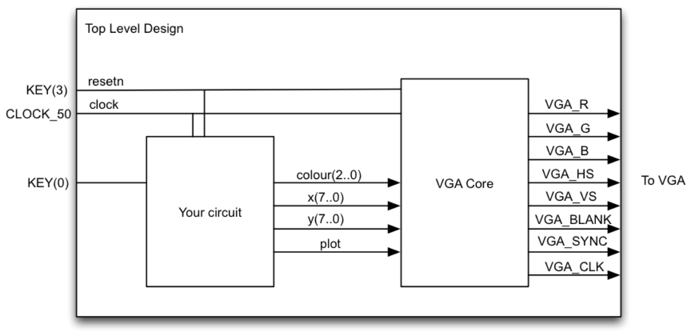
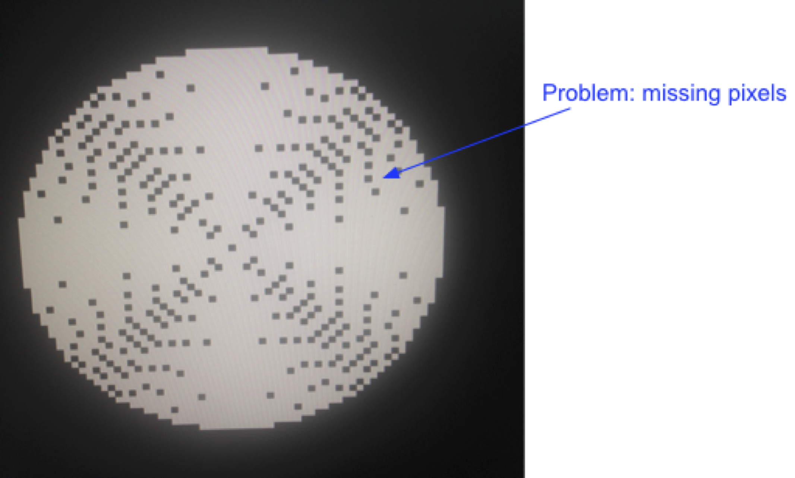

# Lab 2: Circles and Triangles

## Contents

* [Overview](#overview)
* [External IP](#external-ip)
  * [Task 1: Understanding the VGA adapter core](#task-1-understanding-the-vga-adapter-core)
* [Design](#design)
  * [Task 2: Fill the Screen](#task-2-fill-the-screen)
  * [Task 3: Bresenham Circle Algorithm](#task-3-bresenham-circle-algorithm)
  * [Task 4: The Reuleaux triangle](#task-4-the-reuleaux-triangle)
  * [Task 5: Fill 'er up\!](#task-5-fill-er-up)
* [Deliverables and Evaluation](#deliverables-and-evaluation)

## Overview

In this lab, you will get more experience creating datapaths and state machines. You will also learn how to use an embedded VGA adapter core that we will give you to draw images on the screen.

The top level diagram of your lab is shown below. The VGA Core is the part given to you, so all the excitement will be in the block labeled “your circuit.”

## External IP

In the digital design industry, most designs incorporate modules provided by another team or another company. In this lab, we provide you with a VGA adapter module that converts a framebuffer view of the screen to the actual signals expected on the physical VGA port.

### Task 1: Understanding the VGA adapter core

The VGA adapter was created at the University of Toronto for a course similar to CPEN 311. The description below is enough for you to use the core, but you can find the complete specification at [the original site](http://www.eecg.utoronto.ca/~jayar/ece241_07F/vga). Some of the following figures have been taken with permission from that website (with permission.

The VGA adapter has been set up to display a grid of 160x120 pixels, only _slightly_ worse than the [Atari 2600](https://en.wikipedia.org/wiki/Atari_2600_hardware). The interface is as shown below:

| Signal | Direction | Semantics |
| --- | --- | --- |
| resetn      | input  | active-low reset |
| colour[2:0] | input  | pixel colour (3 bits), each bit indicating the presence of one of the RGB components |
| x[7:0]      | input  | x coordinate of pixel to be drawn (0 ≤ x < 160) |
| y[6:0]      | input  | x coordinate of pixel to be drawn (0 ≤ x < 120) |
| plot        | input  | active-high plot enable signal |
| VGA_CLK     | output | VGA clock (25 MHz) |
| VGA_R[9:0]  | output | VGA red component |
| VGA_G[9:0]  | output | VGA green component |
| VGA_B[9:0]  | output | VGA blue component |
| VGA_HS      | output | VGA horizontal sync |
| VGA_VS      | output | VGA vertical sync |
| VGA_SYNC    | output | VGA synchronization type |
| VGA_BLANK   | output | VGA blanking type |

You will connect all outputs of the VGA core directly to the appropriate output pins of the FPGA.

You can picture the VGA pixel grid as shown below. The (_x_,_y_) position (0,0) is located on the top-left corner and (159,119) is at the other extreme end.

To turn on a pixel, you drive the _x_ input with the x position of the pixel, drive the _y_ input with the y position of the pixel, and _colour_ with the colour you wish to use. You then raise the _plot_ signal. At the next rising clock edge, the pixel turns on. In the following timing diagram, two pixels are turned on: one at (15, 62) and the other at (109,12). As you can see, the first pixel drawn is red and is placed at (15, 62), while the second is a yellow pixel at (109, 12). It is important to note that, at most, one pixel can be turned on each cycle — thus, if you want to turn on _m_ pixels, you need _m_ cycles.

The source code for the VGA adapter is in the vga-core folder in this repository. To help you understand it, we have created a vga_demo.sv file which connects the core I/O to switches on the DE1-SoC so you can experiment. We suggest you understand this module and try it out to make sure you understand how the inputs of the core work. (Note that you will not use this file for the other tasks in this Lab.)

## Design

### Task 2: Fill the Screen

You will first create a simple circuit that fills the screen. Each column will be a different colour (repeating every 8 columns). Remember that you can only turn on one pixel at a time, so you would need an algorithm similar to this pseudocode:

    for x = 0 to 159:
        for y = 0 to 119:
            turn on pixel (x, y) with colour (x mod 8)     

You are to create a circuit that implements the above algorithm. A skeleton file `fillscreen.sv`, and a top-level skeleton `task2.sv`, are in the task2 folder.

The interface to the `fillscreen` module is as follows:

| Signal | Direction | Semantics |
| --- | --- | --- |
| clk       | input  | clock |
| rstn      | input  | active-low _asynchronous_ reset |
| colour    | input  | fill colour |
| start     | input  | assert to start filling the screen |
| done      | output | goes high once the entire screen is filled |
| vga_*     | output | outputs to the VGA adapter module |

The user of your module will assert `start` and hold it high until your module asserts `done`.

The `task2` module is the toplevel module you will load into the FPGA. It should instantiate the VGA adapter and your `fillscreen` module, and fill the entire screen with the colour stripes on reset. This must be finished in 19,210 cycles of CLOCK_50 from the time the reset is _deasserted_, i.e., one cycle per screen pixel plus 10 extra cycles; you will need to assert `done` at some point within that time budget.

Recall that in class we described two ways to describe a datapath circuit:

1.  Explicit State Machine / Datapath design method:  In this method, you manually design the datapath and associated state machine, and implement each in SystemVerilog. This involves identifying all the control and status signals you require, and determining exactly what operation is supposed to happen each cycle (in order to create the controller). We looked at simple examples of this in lecture.
2.  Implicit Datapath design method: In this method, you create a combined datapath/controller description. Your description here would look like a state machine, but with operations specified for each state rather than just the values of control signals. By the time you are doing this lab, we haven't talked about this method in class yet.

Our suggestion for this lab is to use the _explicit state machine / datapath_ for your design — that is, create separate datapath and controller modules. You will likely find this easier to write correct synthesizable code this way.

Exhaustively test your design by writing a testbench and simulating everything in ModelSim (hint: look at the counters first).

Next, try your design out on your FPGA board. You will need a VGA cable and a VGA-capable display; in the MCLD labs, a VGA cable and LCD display are provided.

### Task 3: Bresenham Circle Algorithm

The Bresenham Circle algorithm is an integer-only circle-drawing algorithm. The basic algorithm is described in the following pseudocode (modified from Wikipedia):

    draw_circle(centre_x, centre_y, radius):
        offset_y = 0
        offset_x = radius
        crit = 1 - radius
        while offset_y <= offset_x:
            setPixel(centre_x + offset_x, centre_y + offset_y)   -- octant 1
            setPixel(centre_x + offset_y, centre_y + offset_x)   -- octant 2
            setPixel(centre_x - offset_x, centre_y + offset_y)   -- octant 4
            setPixel(centre_x - offset_y, centre_y + offset_x)   -- octant 3
            setPixel(centre_x - offset_x, centre_y - offset_y)   -- octant 5
            setPixel(centre_x - offset_y, centre_y - offset_x)   -- octant 6
            setPixel(centre_x + offset_x, centre_y - offset_y)   -- octant 7
            setPixel(centre_x + offset_y, centre_y - offset_x)   -- octant 8
            offset_y = offset_y + 1
            if crit <= 0:
                crit = crit + 2 * offset_y + 1
            else:
                offset_x = offset_x - 1
                crit = crit + 2 * (offset_y - offset_x) + 1

In this task, you are to implement a circuit that draws a circle with its centre at specified coordinates, a specified radius, and a specified colour. The interface to this `circle` module is as follows:

| Signal | Direction | Semantics |
| --- | --- | --- |
| clk       | input  | clock |
| rstn      | input  | active-low _asynchronous_ reset |
| colour    | input  | drawing colour |
| centre_x  | input  | the x-coordinate of the centre |
| centre_y  | input  | the y-coordinate of the centre |
| radius    | input  | the radius in pixels |
| start     | input  | assert to start filling the screen |
| done      | output | goes high once the entire screen is filled |
| vga_*     | output | outputs to the VGA adapter module |

As with the `fillscreen` module, we will assert `start` and hold it high until your module asserts `done`.

Your `circle` module must work for _any_ centre and radius inputs, _including_ centres and radii where parts of the circle would be off the screen (in which case you must draw only the on-screen parts). As we discussed in lecture, you can do this by refining your datapath from Task 2.

The clock cycle budget you have for `circle` the number of pixels that are actually drawn for the circle in the specified colour, plus 10 extra cycles. You must assert `done` within the cycle budget to receive full credit.

The top-level module `task3` will, on reset, clear the screen to black, and draw a green circle with the centre at (80,60) and a radius of 40. This is what you will demo. The clock cycle budget is 19,200 plus your `circle` budget plus 10.

In designing the datapath for this algorithm, remember that you can only update one pixel per clock cycle. This means that each iteration through the loop will take at least 8 clock cycles (since you are updating 8 pixels per iteration).

Note that you are using CLOCK_50, the 50Mhz clock, to clock your circuit. This is different than Lab 1 where you used a pushbutton switch for your clock.

### Task 4: The Reuleaux triangle

This task requires you to draw a [Reuleaux triangle](https://en.wikipedia.org/wiki/Reuleaux_triangle). This is a figure similar to a chubby equilateral triangle, where each triangle side is replaced by a section of a circle centred at the opposite corner:

You can think of this figure as the boundary of the intersection of three circles like this:

For the Reuleaux triangle, the _centre_ is defined as the point equidistant from all three corners, while the _diameter_ is defined as usual as any segment that passes through the centre and whose endpoints lie on the Reuleaux triangle. This diameter is the same as the length of one side of the inscribed triangle, and the same as the _radius_ of the three circles used to construct it.

Your job is to write a module which draws this figure with the centre coordinates and the diameter as inputs (pointy end up, as in the figures above). You might want to use your circle design and carefully control when the pixels are drawn.

The interface for module `reuleaux` is the same as the one for `circle` from Task 3, except we specify the _diameter_ of the Reuleaux triangle instead of the radius of the circle.

Your cycle budget is the number of cycles that would be required to fully draw all three circles used to construct the Reuleaux triangle, plus 15 cycles; the `done` signal that indicates you are finished must be asserted within this budget. (Note that this is _a lot_ more than is needed to draw the actual triangle; you might want to think about how you would do it without wasting cycles on pixels you never draw.)

At the demo stage you will need to clear the screen to black, and draw a green Reuleaux triangle with the centre at (80,60) and a diameter of 80, so that is what your top-level module `task4` must do on reset. The cycle budget is 19,200 plus your `reuleaux` budget, plus 10 cycles.

### Task 5: Fill 'er up!

For the challenge task, go back to your circle design from Task 3, and modify it to draw a circle and fill it in with a solid colour.

This sounds like it should be easy: the naïve solution would be to draw concentric circles with decreasing radii. The problem with this approach is that it will “miss” some pixels as shown below:

There are several ways to solve this issue. Be creative.

The interface to the `filledcircle` module is exactly the same as the `circle` interface from Task 3. The same colour is used to draw the boundary and fill the inside.

Your cycle budget for `filledcircle` is the sum of the budgets for `circle` for every radius from 1 to the radius of the filled circle, times two. That should be enough for whatever you come up with. As before, you must finish and assert `done` within that time budget.

The toplevel `task5.sv` must clear the screen and draw a filled circle at (80,60) with radius 40. The cycle budget for this is 19,200 plus the budget for `filledcircle` plus 10.

## Deliverables and Evaluation

We will use the same GitHub submission and automatic testing mechanism as in Lab 1. As before, any file that starts with `tb_` will be considered a part of the testbench and not used in evaluating your design.

### Task 1

No deliverables.

### Task 2 [1 mark]

Deliverables in folder `task2`:

- Modified `task2.sv` (the toplevel)
- Modified `fillscreen.sv`
- Any other modified/added source files for your design
- Any files you used to test your design

### Task 3 [4 marks]

Deliverables in folder `task3`:

- Modified `task3.sv` (the toplevel)
- Modified `circle.sv`
- Any other modified/added source files for your design
- Any files you used to test your design

### Task 4 [4 marks]

Deliverables in folder `task4`:

- Modified `task4.sv` (the toplevel)
- Modified `reuleaux.sv`
- Any other modified/added source files for your design
- Any files you used to test your design

### Task 5 [1 mark]

Deliverables in folder `task5`:

- Modified `task5.sv` (the toplevel)
- Modified `filledcircle.sv`
- Any other modified/added source files for your design
- Any files you used to test your design
